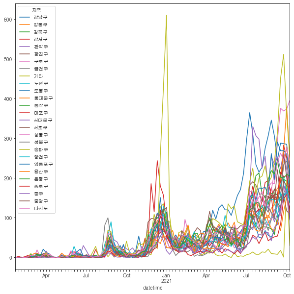
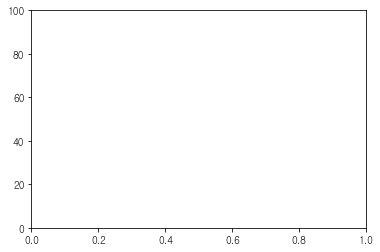
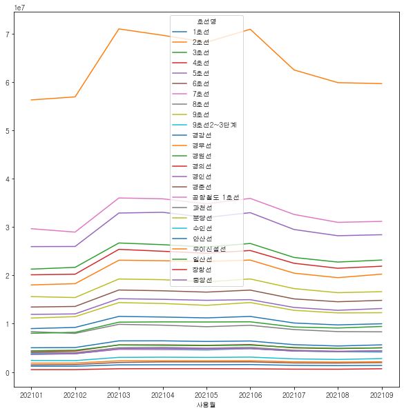
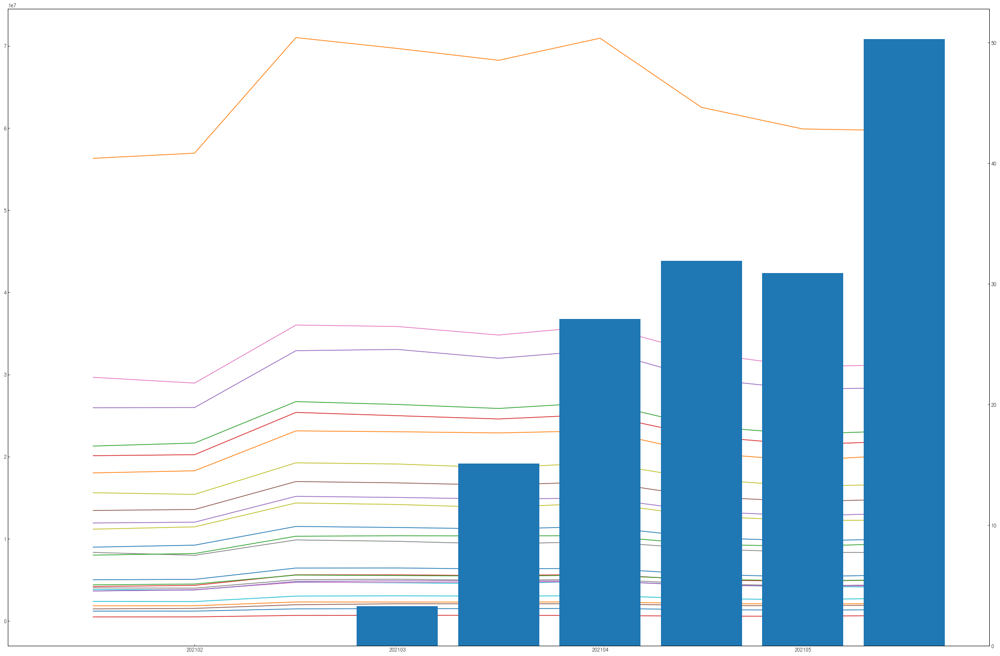

## 10월 상시교육 과제
----------------------
### 10월 상시교육 과제
  -파이썬 

```python
#Q1
import pandas as pd
import numpy as np
from matplotlib import pyplot as plt

excel_url='C:\\Users\\USER\\Desktop\\상시교육과제\\전공_파이썬데이터분석과제_이름_ID.xlsx'

df=pd.read_excel(excel_url, sheet_name=2)
df['datetime']=df['확진일'].apply(lambda x:pd.to_datetime(str(x),format='%Y-%m-%d',errors='raise'))
df.set_index(df['datetime'],inplace=True)
df['count']=1

sorted_series=df.groupby(['지역',pd.Grouper(key='datetime',freq='W')])['count'].sum()
sorted_df=pd.DataFrame(sorted_series,columns=['count'])
```


```python
from matplotlib import rc
import seaborn as sns
%matplotlib inline
rc('font',family='gulim')
plt.rcParams['axes.unicode_minus']=False
table=sorted_df.pivot_table(values='count',index='datetime',columns='지역',fill_value=0)

x_data=pd.date_range(min(df['datetime']),max(df['datetime']),freq='W')
ax=table.plot(figsize=(10,10))
ax.set_xticks(x_data)
```


    [<matplotlib.axis.XTick at 0x1af4fdb8070>,
     <matplotlib.axis.XTick at 0x1af4fdb8040>,
     <matplotlib.axis.XTick at 0x1af4fede700>,
     <matplotlib.axis.XTick at 0x1af4ff9f6d0>,
     <matplotlib.axis.XTick at 0x1af506384c0>,
     <matplotlib.axis.XTick at 0x1af506389d0>,
     <matplotlib.axis.XTick at 0x1af50638ee0>,
     <matplotlib.axis.XTick at 0x1af5063d430>,
     <matplotlib.axis.XTick at 0x1af5063d940>,
     <matplotlib.axis.XTick at 0x1af4fede040>,
     <matplotlib.axis.XTick at 0x1af50651b50>,
     <matplotlib.axis.XTick at 0x1af506610a0>,
     <matplotlib.axis.XTick at 0x1af506615b0>,
     <matplotlib.axis.XTick at 0x1af50661ac0>,
     <matplotlib.axis.XTick at 0x1af50661fd0>,
     <matplotlib.axis.XTick at 0x1af50661640>,
     <matplotlib.axis.XTick at 0x1af50651d90>,
     <matplotlib.axis.XTick at 0x1af506445e0>,
     <matplotlib.axis.XTick at 0x1af50666070>,
     <matplotlib.axis.XTick at 0x1af50666820>,
     <matplotlib.axis.XTick at 0x1af50666d30>,
     <matplotlib.axis.XTick at 0x1af5066d280>,
     <matplotlib.axis.XTick at 0x1af5066d790>,
     <matplotlib.axis.XTick at 0x1af5066dca0>,
     <matplotlib.axis.XTick at 0x1af5066d460>,
     <matplotlib.axis.XTick at 0x1af506664c0>,
     <matplotlib.axis.XTick at 0x1af4fde0610>,
     <matplotlib.axis.XTick at 0x1af506763a0>,
     <matplotlib.axis.XTick at 0x1af506768b0>,
     <matplotlib.axis.XTick at 0x1af50676dc0>,
     <matplotlib.axis.XTick at 0x1af5067d310>,
     <matplotlib.axis.XTick at 0x1af5067d820>,
     <matplotlib.axis.XTick at 0x1af5067dd30>,
     <matplotlib.axis.XTick at 0x1af5067d550>,
     <matplotlib.axis.XTick at 0x1af506765e0>,
     <matplotlib.axis.XTick at 0x1af50666e50>,
     <matplotlib.axis.XTick at 0x1af50681430>,
     <matplotlib.axis.XTick at 0x1af50681940>,
     <matplotlib.axis.XTick at 0x1af50681e80>,
     <matplotlib.axis.XTick at 0x1af50688400>,
     <matplotlib.axis.XTick at 0x1af50688910>,
     <matplotlib.axis.XTick at 0x1af50688e20>,
     <matplotlib.axis.XTick at 0x1af50688640>,
     <matplotlib.axis.XTick at 0x1af50681670>,
     <matplotlib.axis.XTick at 0x1af50676f40>,
     <matplotlib.axis.XTick at 0x1af5068e520>,
     <matplotlib.axis.XTick at 0x1af5068ea30>,
     <matplotlib.axis.XTick at 0x1af5068ef40>,
     <matplotlib.axis.XTick at 0x1af50697490>,
     <matplotlib.axis.XTick at 0x1af506979a0>,
     <matplotlib.axis.XTick at 0x1af50697eb0>,
     <matplotlib.axis.XTick at 0x1af506976d0>,
     <matplotlib.axis.XTick at 0x1af5068e760>,
     <matplotlib.axis.XTick at 0x1af50688070>,
     <matplotlib.axis.XTick at 0x1af5069c5b0>,
     <matplotlib.axis.XTick at 0x1af5069cac0>,
     <matplotlib.axis.XTick at 0x1af5069cfd0>,
     <matplotlib.axis.XTick at 0x1af506a2520>,
     <matplotlib.axis.XTick at 0x1af506a2a30>,
     <matplotlib.axis.XTick at 0x1af506a2f40>,
     <matplotlib.axis.XTick at 0x1af506a2760>,
     <matplotlib.axis.XTick at 0x1af5069c7f0>,
     <matplotlib.axis.XTick at 0x1af50697100>,
     <matplotlib.axis.XTick at 0x1af506a9640>,
     <matplotlib.axis.XTick at 0x1af506a9b50>,
     <matplotlib.axis.XTick at 0x1af506b20a0>,
     <matplotlib.axis.XTick at 0x1af506b25b0>,
     <matplotlib.axis.XTick at 0x1af506b2ac0>,
     <matplotlib.axis.XTick at 0x1af506b2fd0>,
     <matplotlib.axis.XTick at 0x1af506b27f0>,
     <matplotlib.axis.XTick at 0x1af506a9880>,
     <matplotlib.axis.XTick at 0x1af506a2190>,
     <matplotlib.axis.XTick at 0x1af506b66d0>,
     <matplotlib.axis.XTick at 0x1af506b6be0>,
     <matplotlib.axis.XTick at 0x1af506be130>,
     <matplotlib.axis.XTick at 0x1af506be640>,
     <matplotlib.axis.XTick at 0x1af506beb50>,
     <matplotlib.axis.XTick at 0x1af506c50a0>,
     <matplotlib.axis.XTick at 0x1af506be880>,
     <matplotlib.axis.XTick at 0x1af506b6910>,
     <matplotlib.axis.XTick at 0x1af506b2220>,
     <matplotlib.axis.XTick at 0x1af506c5760>,
     <matplotlib.axis.XTick at 0x1af506c5c70>,
     <matplotlib.axis.XTick at 0x1af506cb1c0>,
     <matplotlib.axis.XTick at 0x1af506cb6d0>,
     <matplotlib.axis.XTick at 0x1af506cbbe0>,
     <matplotlib.axis.XTick at 0x1af506d2160>,
     <matplotlib.axis.XTick at 0x1af506cb910>,
     <matplotlib.axis.XTick at 0x1af506c59a0>,
     <matplotlib.axis.XTick at 0x1af506be2b0>]


    

    


```python
#Q2
df2=pd.read_excel(excel_url,sheet_name=4)
condition=(df2['접종일']>='2021.01.01')&(df2['접종일']<='2021.09.31')
df2=df2[condition]

df3=pd.read_excel(excel_url,sheet_name=3)
condition=(df3['사용월']>=202101)&(df3['사용월']<=202109)
df3=df3[condition]
```


```python
import calendar

x_data=['21.01','21.02','21.03','21.04','21.05','21.06','21.07','21.08','21.09']
y_data=[]
for i in range(1,10):
    day=calendar.monthrange(2021,i)[1]
    condition=(df2['접종일']=='2021.'+'0'+str(i)+'.'+str(day))
    if(len(df2[condition])==0):
        y_data.append(0)
    else:
        y_data.append(df2[condition]['2차접종률(%)'])
x_data2=[202101,202102,202103,202103,202104,202105,202106,202107,202108,202109]

plt.ylim([0,100])
plt.bar(x_data2,y_data)
```

    C:\Users\USER\anaconda3\lib\site-packages\numpy\lib\stride_tricks.py:536: VisibleDeprecationWarning: Creating an ndarray from ragged nested sequences (which is a list-or-tuple of lists-or-tuples-or ndarrays with different lengths or shapes) is deprecated. If you meant to do this, you must specify 'dtype=object' when creating the ndarray.
      args = [np.array(_m, copy=False, subok=subok) for _m in args]
    


    ---------------------------------------------------------------------------

    ValueError                                Traceback (most recent call last)

    <ipython-input-4-378d701fc7c9> in <module>
         13 
         14 plt.ylim([0,100])
    ---> 15 plt.bar(x_data2,y_data)
    

    ~\anaconda3\lib\site-packages\matplotlib\pyplot.py in bar(x, height, width, bottom, align, data, **kwargs)
       2485         x, height, width=0.8, bottom=None, *, align='center',
       2486         data=None, **kwargs):
    -> 2487     return gca().bar(
       2488         x, height, width=width, bottom=bottom, align=align,
       2489         **({"data": data} if data is not None else {}), **kwargs)
    

    ~\anaconda3\lib\site-packages\matplotlib\__init__.py in inner(ax, data, *args, **kwargs)
       1445     def inner(ax, *args, data=None, **kwargs):
       1446         if data is None:
    -> 1447             return func(ax, *map(sanitize_sequence, args), **kwargs)
       1448 
       1449         bound = new_sig.bind(ax, *args, **kwargs)
    

    ~\anaconda3\lib\site-packages\matplotlib\axes\_axes.py in bar(self, x, height, width, bottom, align, **kwargs)
       2428                 yerr = self._convert_dx(yerr, y0, y, self.convert_yunits)
       2429 
    -> 2430         x, height, width, y, linewidth = np.broadcast_arrays(
       2431             # Make args iterable too.
       2432             np.atleast_1d(x), height, width, y, linewidth)
    

    <__array_function__ internals> in broadcast_arrays(*args, **kwargs)
    

    ~\anaconda3\lib\site-packages\numpy\lib\stride_tricks.py in broadcast_arrays(subok, *args)
        536     args = [np.array(_m, copy=False, subok=subok) for _m in args]
        537 
    --> 538     shape = _broadcast_shape(*args)
        539 
        540     if all(array.shape == shape for array in args):
    

    ~\anaconda3\lib\site-packages\numpy\lib\stride_tricks.py in _broadcast_shape(*args)
        418     # use the old-iterator because np.nditer does not handle size 0 arrays
        419     # consistently
    --> 420     b = np.broadcast(*args[:32])
        421     # unfortunately, it cannot handle 32 or more arguments directly
        422     for pos in range(32, len(args), 31):
    

    ValueError: shape mismatch: objects cannot be broadcast to a single shape


    

    


```python
df_temp=df3.drop(['작업일자','사용월'],axis=1)
df3['총이용인원']=df_temp.sum(axis=1)
df3
```


<div>
<style scoped>
    .dataframe tbody tr th:only-of-type {
        vertical-align: middle;
    }

    .dataframe tbody tr th {
        vertical-align: top;
    }

    .dataframe thead th {
        text-align: right;
    }
</style>
<table border="1" class="dataframe">
  <thead>
    <tr style="text-align: right;">
      <th></th>
      <th>사용월</th>
      <th>호선명</th>
      <th>지하철역</th>
      <th>04시-05시 승차인원</th>
      <th>04시-05시 하차인원</th>
      <th>05시-06시 승차인원</th>
      <th>05시-06시 하차인원</th>
      <th>06시-07시 승차인원</th>
      <th>06시-07시 하차인원</th>
      <th>07시-08시 승차인원</th>
      <th>...</th>
      <th>00시-01시 승차인원</th>
      <th>00시-01시 하차인원</th>
      <th>01시-02시 승차인원</th>
      <th>01시-02시 하차인원</th>
      <th>02시-03시 승차인원</th>
      <th>02시-03시 하차인원</th>
      <th>03시-04시 승차인원</th>
      <th>03시-04시 하차인원</th>
      <th>작업일자</th>
      <th>총이용인원</th>
    </tr>
  </thead>
  <tbody>
    <tr>
      <th>0</th>
      <td>202109</td>
      <td>1호선</td>
      <td>동대문</td>
      <td>504</td>
      <td>11</td>
      <td>10220</td>
      <td>1863</td>
      <td>8046</td>
      <td>5696</td>
      <td>12719</td>
      <td>...</td>
      <td>16</td>
      <td>1094</td>
      <td>1</td>
      <td>0</td>
      <td>0</td>
      <td>0</td>
      <td>0</td>
      <td>0</td>
      <td>20211003</td>
      <td>569753</td>
    </tr>
    <tr>
      <th>1</th>
      <td>202109</td>
      <td>1호선</td>
      <td>동묘앞</td>
      <td>91</td>
      <td>2</td>
      <td>2562</td>
      <td>828</td>
      <td>3100</td>
      <td>4244</td>
      <td>5177</td>
      <td>...</td>
      <td>1</td>
      <td>961</td>
      <td>0</td>
      <td>0</td>
      <td>0</td>
      <td>0</td>
      <td>0</td>
      <td>0</td>
      <td>20211003</td>
      <td>508983</td>
    </tr>
    <tr>
      <th>2</th>
      <td>202109</td>
      <td>1호선</td>
      <td>서울역</td>
      <td>540</td>
      <td>16</td>
      <td>7420</td>
      <td>5818</td>
      <td>10588</td>
      <td>32295</td>
      <td>30994</td>
      <td>...</td>
      <td>21</td>
      <td>512</td>
      <td>0</td>
      <td>0</td>
      <td>0</td>
      <td>0</td>
      <td>0</td>
      <td>0</td>
      <td>20211003</td>
      <td>1873853</td>
    </tr>
    <tr>
      <th>3</th>
      <td>202109</td>
      <td>1호선</td>
      <td>시청</td>
      <td>25</td>
      <td>0</td>
      <td>1677</td>
      <td>4542</td>
      <td>2640</td>
      <td>17026</td>
      <td>5680</td>
      <td>...</td>
      <td>5</td>
      <td>103</td>
      <td>0</td>
      <td>0</td>
      <td>0</td>
      <td>0</td>
      <td>0</td>
      <td>0</td>
      <td>20211003</td>
      <td>899218</td>
    </tr>
    <tr>
      <th>4</th>
      <td>202109</td>
      <td>1호선</td>
      <td>신설동</td>
      <td>267</td>
      <td>10</td>
      <td>6634</td>
      <td>2613</td>
      <td>7049</td>
      <td>9896</td>
      <td>14872</td>
      <td>...</td>
      <td>11</td>
      <td>458</td>
      <td>0</td>
      <td>0</td>
      <td>0</td>
      <td>0</td>
      <td>0</td>
      <td>0</td>
      <td>20211003</td>
      <td>650554</td>
    </tr>
    <tr>
      <th>...</th>
      <td>...</td>
      <td>...</td>
      <td>...</td>
      <td>...</td>
      <td>...</td>
      <td>...</td>
      <td>...</td>
      <td>...</td>
      <td>...</td>
      <td>...</td>
      <td>...</td>
      <td>...</td>
      <td>...</td>
      <td>...</td>
      <td>...</td>
      <td>...</td>
      <td>...</td>
      <td>...</td>
      <td>...</td>
      <td>...</td>
      <td>...</td>
    </tr>
    <tr>
      <th>5455</th>
      <td>202101</td>
      <td>중앙선</td>
      <td>원덕</td>
      <td>15</td>
      <td>0</td>
      <td>228</td>
      <td>4</td>
      <td>346</td>
      <td>49</td>
      <td>470</td>
      <td>...</td>
      <td>6</td>
      <td>26</td>
      <td>0</td>
      <td>0</td>
      <td>0</td>
      <td>0</td>
      <td>0</td>
      <td>0</td>
      <td>20210203</td>
      <td>12668</td>
    </tr>
    <tr>
      <th>5456</th>
      <td>202101</td>
      <td>중앙선</td>
      <td>중랑</td>
      <td>75</td>
      <td>1</td>
      <td>4549</td>
      <td>374</td>
      <td>7275</td>
      <td>1780</td>
      <td>17855</td>
      <td>...</td>
      <td>6</td>
      <td>124</td>
      <td>0</td>
      <td>0</td>
      <td>0</td>
      <td>0</td>
      <td>0</td>
      <td>0</td>
      <td>20210203</td>
      <td>239216</td>
    </tr>
    <tr>
      <th>5457</th>
      <td>202101</td>
      <td>중앙선</td>
      <td>지평</td>
      <td>0</td>
      <td>0</td>
      <td>0</td>
      <td>0</td>
      <td>0</td>
      <td>0</td>
      <td>188</td>
      <td>...</td>
      <td>0</td>
      <td>0</td>
      <td>0</td>
      <td>0</td>
      <td>0</td>
      <td>0</td>
      <td>0</td>
      <td>0</td>
      <td>20210203</td>
      <td>2177</td>
    </tr>
    <tr>
      <th>5458</th>
      <td>202101</td>
      <td>중앙선</td>
      <td>팔당</td>
      <td>0</td>
      <td>0</td>
      <td>110</td>
      <td>55</td>
      <td>418</td>
      <td>386</td>
      <td>849</td>
      <td>...</td>
      <td>0</td>
      <td>0</td>
      <td>0</td>
      <td>0</td>
      <td>0</td>
      <td>0</td>
      <td>0</td>
      <td>0</td>
      <td>20210203</td>
      <td>44604</td>
    </tr>
    <tr>
      <th>5459</th>
      <td>202101</td>
      <td>중앙선</td>
      <td>회기</td>
      <td>467</td>
      <td>5</td>
      <td>7992</td>
      <td>2525</td>
      <td>15491</td>
      <td>8275</td>
      <td>41272</td>
      <td>...</td>
      <td>74</td>
      <td>1129</td>
      <td>0</td>
      <td>0</td>
      <td>0</td>
      <td>0</td>
      <td>0</td>
      <td>0</td>
      <td>20210203</td>
      <td>979713</td>
    </tr>
  </tbody>
</table>
<p>5460 rows × 53 columns</p>
</div>


```python
sorted_series3=df3.groupby(['호선명','사용월'])['총이용인원'].sum()
sorted_df3=pd.DataFrame(sorted_series3,columns=['총이용인원'])
pd.DataFrame(sorted_df3.loc['1호선','총이용인원'])
```


<div>
<style scoped>
    .dataframe tbody tr th:only-of-type {
        vertical-align: middle;
    }

    .dataframe tbody tr th {
        vertical-align: top;
    }

    .dataframe thead th {
        text-align: right;
    }
</style>
<table border="1" class="dataframe">
  <thead>
    <tr style="text-align: right;">
      <th></th>
      <th>총이용인원</th>
    </tr>
    <tr>
      <th>사용월</th>
      <th></th>
    </tr>
  </thead>
  <tbody>
    <tr>
      <th>202101</th>
      <td>8982246</td>
    </tr>
    <tr>
      <th>202102</th>
      <td>9221920</td>
    </tr>
    <tr>
      <th>202103</th>
      <td>11501542</td>
    </tr>
    <tr>
      <th>202104</th>
      <td>11372871</td>
    </tr>
    <tr>
      <th>202105</th>
      <td>11195148</td>
    </tr>
    <tr>
      <th>202106</th>
      <td>11494793</td>
    </tr>
    <tr>
      <th>202107</th>
      <td>10136973</td>
    </tr>
    <tr>
      <th>202108</th>
      <td>9740681</td>
    </tr>
    <tr>
      <th>202109</th>
      <td>9980235</td>
    </tr>
  </tbody>
</table>
</div>


```python
from matplotlib import rc
import seaborn as sns
%matplotlib inline

rc('font',family='gulim')
plt.rcParams['axes.unicode_minus']=False

table=sorted_df3.pivot_table(values='총이용인원',index='사용월',columns='호선명',fill_value=0)
table
```


<div>
<style scoped>
    .dataframe tbody tr th:only-of-type {
        vertical-align: middle;
    }

    .dataframe tbody tr th {
        vertical-align: top;
    }

    .dataframe thead th {
        text-align: right;
    }
</style>
<table border="1" class="dataframe">
  <thead>
    <tr style="text-align: right;">
      <th>호선명</th>
      <th>1호선</th>
      <th>2호선</th>
      <th>3호선</th>
      <th>4호선</th>
      <th>5호선</th>
      <th>6호선</th>
      <th>7호선</th>
      <th>8호선</th>
      <th>9호선</th>
      <th>9호선2~3단계</th>
      <th>...</th>
      <th>경춘선</th>
      <th>공항철도 1호선</th>
      <th>과천선</th>
      <th>분당선</th>
      <th>수인선</th>
      <th>안산선</th>
      <th>우이신설선</th>
      <th>일산선</th>
      <th>장항선</th>
      <th>중앙선</th>
    </tr>
    <tr>
      <th>사용월</th>
      <th></th>
      <th></th>
      <th></th>
      <th></th>
      <th></th>
      <th></th>
      <th></th>
      <th></th>
      <th></th>
      <th></th>
      <th></th>
      <th></th>
      <th></th>
      <th></th>
      <th></th>
      <th></th>
      <th></th>
      <th></th>
      <th></th>
      <th></th>
      <th></th>
    </tr>
  </thead>
  <tbody>
    <tr>
      <th>202101</th>
      <td>8982246</td>
      <td>56303019</td>
      <td>21283426</td>
      <td>20112122</td>
      <td>25947793</td>
      <td>13442450</td>
      <td>29650569</td>
      <td>8340897</td>
      <td>11165664</td>
      <td>3809017</td>
      <td>...</td>
      <td>1465364</td>
      <td>3645026</td>
      <td>4026415</td>
      <td>15601566</td>
      <td>2375496</td>
      <td>5012935</td>
      <td>1840911</td>
      <td>4391493</td>
      <td>487870</td>
      <td>3648273</td>
    </tr>
    <tr>
      <th>202102</th>
      <td>9221920</td>
      <td>56931162</td>
      <td>21650716</td>
      <td>20233006</td>
      <td>25972275</td>
      <td>13563967</td>
      <td>28947276</td>
      <td>7988173</td>
      <td>11450068</td>
      <td>3783604</td>
      <td>...</td>
      <td>1528051</td>
      <td>3810089</td>
      <td>3989914</td>
      <td>15403348</td>
      <td>2357071</td>
      <td>5057247</td>
      <td>1844711</td>
      <td>4493535</td>
      <td>494366</td>
      <td>3768287</td>
    </tr>
    <tr>
      <th>202103</th>
      <td>11501542</td>
      <td>70999030</td>
      <td>26695227</td>
      <td>25378237</td>
      <td>32892794</td>
      <td>16967155</td>
      <td>36012370</td>
      <td>9860409</td>
      <td>14357690</td>
      <td>4727589</td>
      <td>...</td>
      <td>1972129</td>
      <td>4686780</td>
      <td>5016780</td>
      <td>19244091</td>
      <td>3021232</td>
      <td>6438541</td>
      <td>2308388</td>
      <td>5581181</td>
      <td>672480</td>
      <td>4802140</td>
    </tr>
    <tr>
      <th>202104</th>
      <td>11372871</td>
      <td>69677619</td>
      <td>26346589</td>
      <td>24979856</td>
      <td>33044136</td>
      <td>16802817</td>
      <td>35836971</td>
      <td>9690247</td>
      <td>14172812</td>
      <td>4640837</td>
      <td>...</td>
      <td>2088317</td>
      <td>4700573</td>
      <td>5077788</td>
      <td>19099842</td>
      <td>3059054</td>
      <td>6447219</td>
      <td>2300295</td>
      <td>5520831</td>
      <td>684498</td>
      <td>4886555</td>
    </tr>
    <tr>
      <th>202105</th>
      <td>11195148</td>
      <td>68236496</td>
      <td>25859850</td>
      <td>24581762</td>
      <td>31967876</td>
      <td>16528382</td>
      <td>34797189</td>
      <td>9370033</td>
      <td>13799203</td>
      <td>4543864</td>
      <td>...</td>
      <td>2084974</td>
      <td>4699456</td>
      <td>4923975</td>
      <td>18643225</td>
      <td>3017010</td>
      <td>6315942</td>
      <td>2296529</td>
      <td>5462022</td>
      <td>689469</td>
      <td>4856419</td>
    </tr>
    <tr>
      <th>202106</th>
      <td>11494793</td>
      <td>70925213</td>
      <td>26594741</td>
      <td>25136678</td>
      <td>32968818</td>
      <td>16945658</td>
      <td>35925120</td>
      <td>9659611</td>
      <td>14370336</td>
      <td>4839370</td>
      <td>...</td>
      <td>2087966</td>
      <td>4828797</td>
      <td>5086172</td>
      <td>19253086</td>
      <td>3078464</td>
      <td>6415437</td>
      <td>2314297</td>
      <td>5562494</td>
      <td>662108</td>
      <td>4858281</td>
    </tr>
    <tr>
      <th>202107</th>
      <td>10136973</td>
      <td>62508425</td>
      <td>23696540</td>
      <td>22495138</td>
      <td>29486275</td>
      <td>15125164</td>
      <td>32602325</td>
      <td>8780194</td>
      <td>12760657</td>
      <td>4359657</td>
      <td>...</td>
      <td>1868772</td>
      <td>4337533</td>
      <td>4494789</td>
      <td>17257410</td>
      <td>2714448</td>
      <td>5653979</td>
      <td>2112068</td>
      <td>5065860</td>
      <td>581785</td>
      <td>4337494</td>
    </tr>
    <tr>
      <th>202108</th>
      <td>9740681</td>
      <td>59877347</td>
      <td>22745734</td>
      <td>21465689</td>
      <td>28195756</td>
      <td>14534039</td>
      <td>30966482</td>
      <td>8361375</td>
      <td>12226090</td>
      <td>4187677</td>
      <td>...</td>
      <td>1850277</td>
      <td>4265428</td>
      <td>4283201</td>
      <td>16412847</td>
      <td>2590881</td>
      <td>5378916</td>
      <td>2055015</td>
      <td>4891353</td>
      <td>570710</td>
      <td>4224984</td>
    </tr>
    <tr>
      <th>202109</th>
      <td>9980235</td>
      <td>59674070</td>
      <td>23163816</td>
      <td>21886354</td>
      <td>28403895</td>
      <td>14825732</td>
      <td>31165245</td>
      <td>8309778</td>
      <td>12266144</td>
      <td>4109677</td>
      <td>...</td>
      <td>1933594</td>
      <td>4248393</td>
      <td>4387805</td>
      <td>16620225</td>
      <td>2773904</td>
      <td>5614707</td>
      <td>2117479</td>
      <td>4987252</td>
      <td>668574</td>
      <td>4402014</td>
    </tr>
  </tbody>
</table>
<p>9 rows × 25 columns</p>
</div>


```python
x_data2=['','202101','202102','202103','202104','202105','202106','202107','202108','202109']
ax=table.plot(figsize=(10,10))
ax.set_xticklabels(x_data2)
```

    <ipython-input-8-701a7e69c6c0>:3: UserWarning: FixedFormatter should only be used together with FixedLocator
      ax.set_xticklabels(x_data2)
    


    [Text(202100.0, 0, ''),
     Text(202101.0, 0, '202101'),
     Text(202102.0, 0, '202102'),
     Text(202103.0, 0, '202103'),
     Text(202104.0, 0, '202104'),
     Text(202105.0, 0, '202105'),
     Text(202106.0, 0, '202106'),
     Text(202107.0, 0, '202107'),
     Text(202108.0, 0, '202108'),
     Text(202109.0, 0, '202109'),
     Text(202110.0, 0, '')]


    

    


```python
plt.rcParams['figure.figsize']=(36,24)
fig,ax1=plt.subplots()

ax1.plot(table)
x_data2=[202101,202102,202103,202104,202105,202106,202107,202108,202109]

ax1.set_xticklabels(x_data2)
ax1.tick_params(axis='both',direction='in')
ax2=ax1.twinx()
ax2.bar(x_data2,y_data)
ax2.tick_params(axis='y',direction='in')
```

    <ipython-input-9-0da5a89664ca>:7: UserWarning: FixedFormatter should only be used together with FixedLocator
      ax1.set_xticklabels(x_data2)
    C:\Users\USER\anaconda3\lib\site-packages\numpy\lib\stride_tricks.py:536: VisibleDeprecationWarning: Creating an ndarray from ragged nested sequences (which is a list-or-tuple of lists-or-tuples-or ndarrays with different lengths or shapes) is deprecated. If you meant to do this, you must specify 'dtype=object' when creating the ndarray.
      args = [np.array(_m, copy=False, subok=subok) for _m in args]
    C:\Users\USER\anaconda3\lib\site-packages\numpy\core\_asarray.py:102: VisibleDeprecationWarning: Creating an ndarray from ragged nested sequences (which is a list-or-tuple of lists-or-tuples-or ndarrays with different lengths or shapes) is deprecated. If you meant to do this, you must specify 'dtype=object' when creating the ndarray.
      return array(a, dtype, copy=False, order=order)
    


    

    

